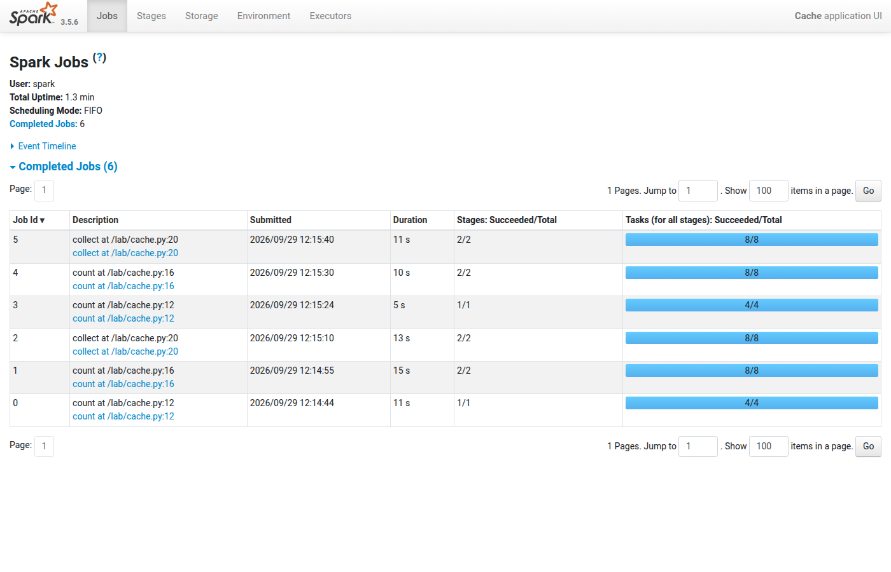
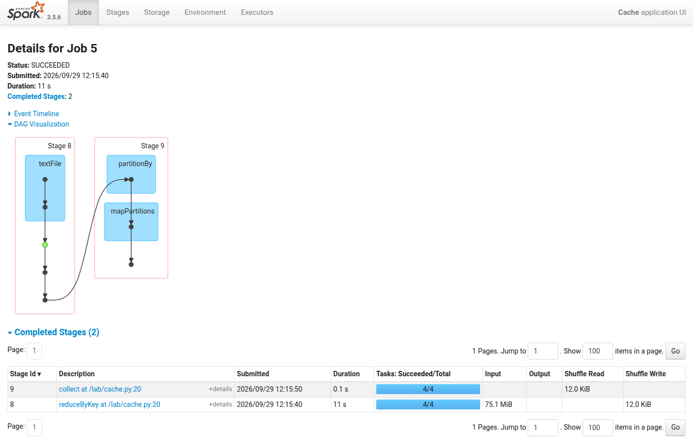
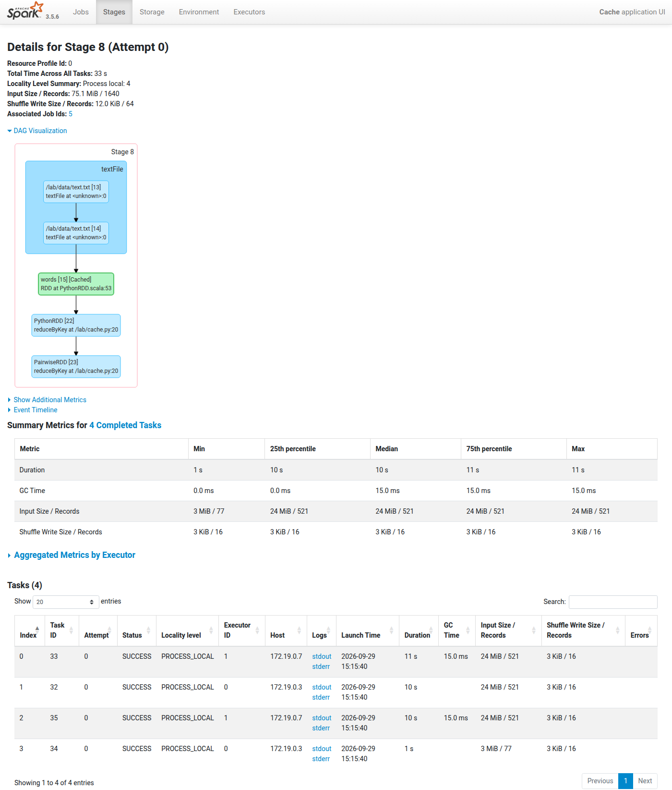
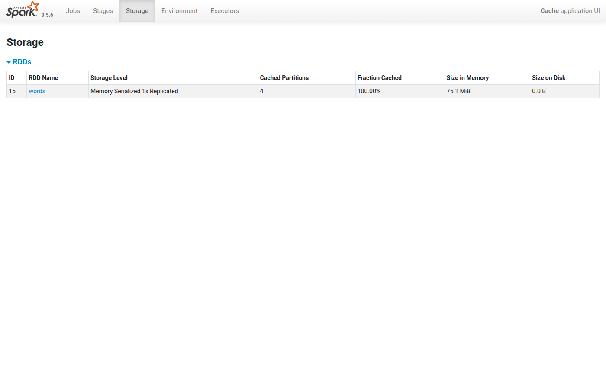

# Лабораторная работа 1. Методы пакетной обработки данных

Окружение (`docker-compose.yml`): Hadoop 3.4.1 (namenode, datanode, resourcemanager, nodemanager),
Spark 3.5.6 (master + 2 workers по 2 ядра).

Данные (`gen_data.py`): `data/text.txt` — текст 100 МБ, `data/graph.txt` — граф из 1000 вершин.

Генерация данных:
```
python3 gen_data.py
```

Запуск кластера:
```
docker compose up -d
```

## 1. MapReduce WordCount на HDFS

Код: `WordCount.java` (Mapper, Combiner, Reducer).

Компиляция:
```
docker compose cp namenode:/opt/hadoop/share/hadoop ./hadoop-libs
javac --release 8 -cp "hadoop-libs/common/*:hadoop-libs/common/lib/*:hadoop-libs/mapreduce/*" WordCount.java
jar cf wc.jar WordCount*.class
rm -rf hadoop-libs WordCount*.class
```

Запуск:
```
docker compose exec namenode hdfs dfs -mkdir -p /input
docker compose exec namenode hdfs dfs -put /lab/data/text.txt /input/
docker compose exec namenode hadoop jar /lab/wc.jar WordCount /input /output
docker compose exec namenode bash -c "hdfs dfs -cat /output/part-r-00000 | sort -k2 -nr | head -5"
```

Вывод (полностью в `hadoop_out.log`):
```
Launched map tasks=1
Launched reduce tasks=1
Map input records=2165256
Map output records=25983072
Map output bytes=208789926
Combine output records=2241
Reduce shuffle bytes=2731
Reduce output records=249
```
```
the   4260853
of    2134350
and   1421346
to    1066413
a     851143
```

Анализ:
- файл меньше блока HDFS (128 МБ), поэтому 1 сплит и 1 map-задача;
- map выдал 26 млн пар (208 МБ), после combiner в reduce передано 2.7 КБ;
- 249 уникальных слов, время ~71 с.

## 2. Кластер Spark

Master и 2 workers описаны в `docker-compose.yml`. Запуск приложений:
```
docker compose exec spark-master /opt/spark/bin/spark-submit --master spark://spark-master:7077 /lab/<файл>.py
```

## 3. Spark-приложения

### 3а. WordCount

`wordcount_rdd.py` — RDD: flatMap → map → reduceByKey.
`wordcount_df.py` — DataFrame: explode(split) → groupBy → count.

Результаты совпадают с Hadoop (249 слов, the 4260853, of 2134350, ...).

| Вариант | Время, с |
|---|---|
| RDD | 21.7 |
| DataFrame | 17.1 |

План DataFrame (`explain()`): partial_count → Exchange (shuffle) → count.
```
+- HashAggregate(keys=[word#3], functions=[count(1)])
   +- Exchange hashpartitioning(word#3, 200)
      +- HashAggregate(keys=[word#3], functions=[partial_count(1)])
         +- Generate explode(split(value#0,  , -1))
            +- FileScan text
```

### 3б. PageRank

`pagerank.py`: 1000 вершин, 10 итераций, `links` закэширован. Время 23.7 с.

```
542 4.1446
715 3.5804
212 3.4247
302 3.3458
489 3.0494
```

## 4. Влияние числа партиций

`partitions.py`: WordCount RDD, `textFile(path, n)` и `reduceByKey(..., n)`.

| Партиций | Входных партиций | Время, с |
|---|---|---|
| 1 | 4 | 18.88 |
| 2 | 4 | 12.10 |
| 4 | 4 | 10.27 |
| 8 | 8 | 10.02 |
| 16 | 16 | 11.31 |
| 32 | 32 | 13.69 |
| 64 | 64 | 14.64 |
| 128 | 128 | 24.34 |

При n < 4 входных партиций 4 (файл делится на блоки по 32 МБ).

Вывод: оптимум 4–8 партиций (4 ядра). При меньшем числе ядра простаивают, при большем растут накладные
расходы на задачи и shuffle.

## 5. repartition / coalesce

`partitions.py`, исходно 64 партиции:
```
coalesce(4): 4
repartition(4): 4
coalesce(128): 64
repartition(128): 128
```

Lineage: у coalesce нет shuffle, у repartition есть ShuffledRDD.
```
(4) CoalescedRDD[70] at coalesce
 |  /lab/data/text.txt MapPartitionsRDD[57] at textFile

(4) MapPartitionsRDD[75] at coalesce
 |  CoalescedRDD[74] at coalesce
 |  ShuffledRDD[73] at coalesce
 +-(64) MapPartitionsRDD[72] at coalesce
```

| Вариант | Время, с |
|---|---|
| 64 партиции | 14.19 |
| coalesce(4) | 14.75 |
| repartition(4) | 18.12 |

Вывод: coalesce только уменьшает число партиций и работает без shuffle; repartition может и увеличить,
и уменьшить, но делает полный shuffle, поэтому медленнее.

## 6. persist / cache

`cache.py`: 3 действия над одним RDD слов (count, distinct().count(), reduceByKey().collect()) без кэша и с `cache()`.

| | count | distinct | reduceByKey | Всего |
|---|---|---|---|---|
| Без кэша, с | 11.28 | 15.40 | 13.59 | 40.27 |
| С кэшем, с | 5.49 | 10.10 | 10.96 | 26.55 |

Вывод: с кэшем ~1.5 раза быстрее — данные берутся из памяти (75 МБ), а не читаются и разбираются заново.

## 7. Spark Web UI

```
docker compose exec spark-master /opt/spark/bin/spark-submit --master spark://spark-master:7077 /lab/cache.py 300
```
UI: http://localhost:4040

Jobs — каждое действие отдельный job:



DAG job'а с reduceByKey: 2 стадии, граница между ними — shuffle (Shuffle Write / Shuffle Read 12 КБ).
Зелёная точка — закэшированный RDD:



Стадия: `words [Cached]` — данные из кэша, 4 задачи (по числу партиций), все PROCESS_LOCAL:



Storage: RDD `words`, 4 партиции, 75.1 МБ в памяти:



Shuffle: reduceByKey, distinct, groupByKey, join, repartition (в DataFrame — Exchange).
Без shuffle: map, flatMap, filter, coalesce.

## Сравнение Hadoop и Spark

| | Hadoop MapReduce | Spark RDD | Spark DataFrame |
|---|---|---|---|
| WordCount 100 МБ, с | ~71 | 21.7 | 17.1 |

- Производительность: Spark хранит промежуточные данные в памяти и не запускает новые процессы на каждую задачу.
- Разработка: в Spark WordCount — несколько строк на Python, в Hadoop — Java-классы и сборка jar.
- Повторное использование данных: в Spark есть cache/persist, в Hadoop данные между job'ами передаются через HDFS.
